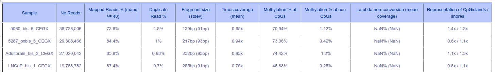
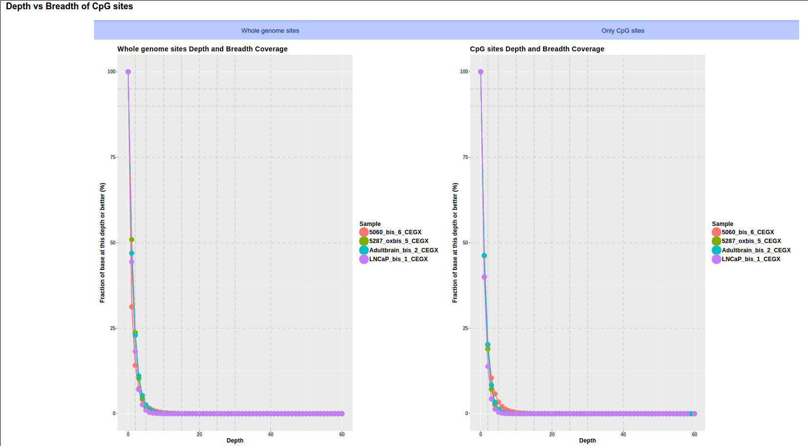
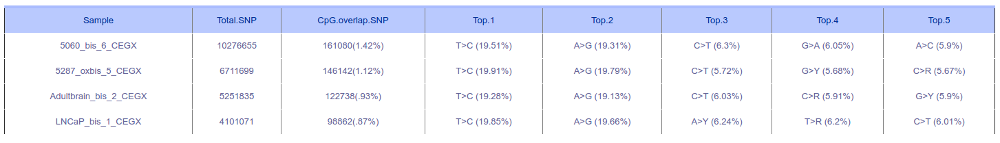
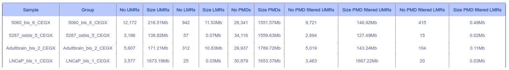
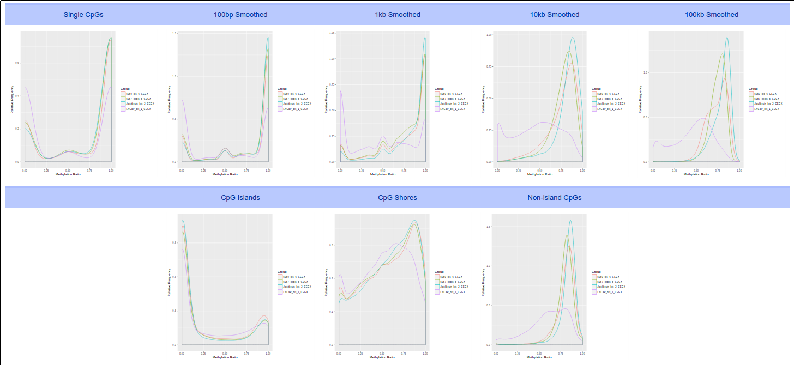
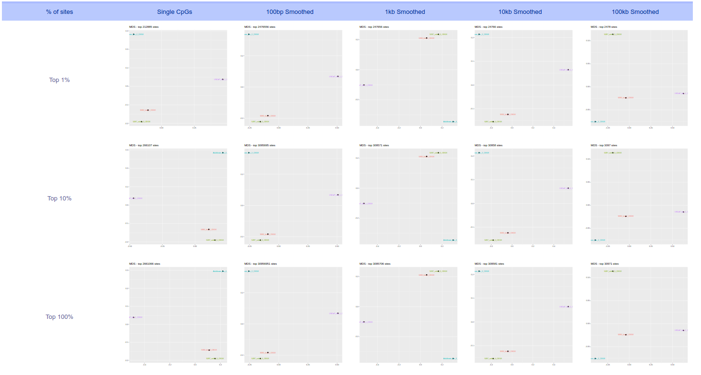
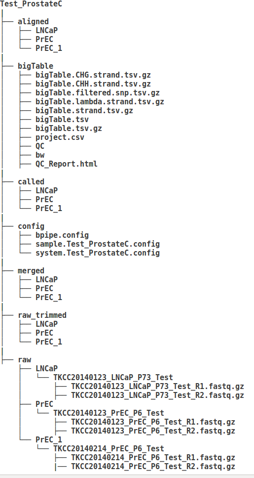

# WGBSX10

* WGBSX10 is a pipeline of parallel alignment whole genome bisulfite sequencing (WGBS) or nucleosome occupancy and DNA methylation (NOMEseq) from fastq files of multi samples (approx. 8-16 samples with more than 20X coverage for each) and generating:
  * An HTML report of quality control detail metrics: percent mapped reads, methylation average of CpG and non-CpG, bisulfite conversion rate, CpG islands/shores bias, coverage bias between all sites and CpG sites, percent SNP overlapping with CpG sites, Top 5 SNPs in each sample.
  * A tsv big table of CG/CHH/CHG with filtered/unfiltered SNP
  * SNP calling
  * PMD, LMR, UMR, HMR calling 
  * Bigwig files of whole genome coverage, only CpG coverage, CpG methylation of each sample for IGV visualization
of these samples

* WGBSX10 is designed for running on cluster such as SGE/PBS. It requires 4GB of memory to maintain the running of the whole workflow.

* WGBSX10 helps to speed up the whole workflow of high coverage WGBS as well as enhance the accurate of methylation and SNP calling.

* WGBSX10 is built based on in-house bash/python/perl/R script, Bpipe and a collection of software packages:
  * [bwa]                 https://github.com/lh3/bwa
  * [bwa-meth, 1.0]       https://github.com/brentp/bwa-meth
  * [samtools, 1.2.1]     https://github.com/samtools/
  * [tabix, 1.2.1]        https://github.com/samtools/tabix
  * [qualimap, 2.2.1]     http://qualimap.bioinfo.cipf.es/
  * [SAMStat]      http://samstat.sourceforge.net/
  * [picardtools]  https://github.com/broadinstitute/picard
  * [bedtools]     https://github.com/arq5x/bedtools2
  * [Bpipe]        https://github.com/ssadedin/bpipe
  * [bamUtil]      https://github.com/statgen/bamUtil
  * [MethylDackel] https://github.com/dpryan79/MethylDackel
  * [Biscuit]      https://github.com/zwdzwd/biscuit
  * [MethylSeekR]  https://github.com/Bioconductor-mirror/MethylSeekR
  * [Vcf-tools]    https://github.com/vcftools
  * [fastqc]       http://www.bioinformatics.babraham.ac.uk/projects/fastqc/
  * [trimCEGX]     https://github.com/luuloi/trim.paired.read
  * [makeFullDataFrame] https://github.com/luuloi/make.full.data.frame
  * [merge_columns_multi_tsv] https://github.com/luuloi/merge_columns_multi_tsv
  * [UCSC-format-file-converter]  http://hgdownload.soe.ucsc.edu/admin/exe/linux.x86_64/
  * [ggplot2]      https://github.com/tidyverse/ggplot2
  * [BSgenome.Hsapiens.UCSC.version]  https://github.com/Przemol/BSgenome.Hsapiens.UCSC.version
  * [GenomicRanges]  https://github.com/Bioconductor-mirror/GenomicRanges
  * [rtracklayer]    https://github.com/Bioconductor-mirror/rtracklayer
  * [python modules] configobj, argparse
  
* Dependencies
  * Java version >= 1.8
  * All the above listed software packages, here are some commands to install python and R packages
    * [python version >= 2.7] 
      * pip install configobj argparse
    * [R version >= 3.2] 
      * source("https://bioconductor.org/biocLite.R")
      * biocLite(c("BSgenome.Hsapiens.UCSC.hg19", "rtracklayer", "GenomicRanges", "MethylSeekR")) 
      * install.packages(c("ggplot2", "data.table", "ggfortify", "knitr"))

* Installation
  * git clone git@github.com:luuloi/WGBSX10.git
  * or
  * git clone https://github.com/luuloi/WGBSX10.git
  
* Inputs require 
  * Paired fastq files in .gz format for each sample
  * Filled sample config file, example https://github.com/luuloi/WGBSX10/blob/master/config/sample.Test_ProstateC.config
  * Filled system config file, example https://github.com/luuloi/WGBSX10/blob/master/config/system.Test_ProstateC.config
  * Note: 
       * The fastq files are located in project/raw/LNCaP/lane1/lane1_R1.fastq.gz,                                          project/raw/sample/lane2/lane1_R2.fastq.gz of each sample.
       * Lane and sample name should not have any dots '.' in it.
                                       
* First Run [TODO]
  * Indexing the human genome/or download the indexed genome before alignment
  * Run the pipeline: https://github.com/luuloi/WGBSX10/blob/master/example/example.sh
    * module load phuluu/python/2.7.8
    * module load gi/java/jdk1.8.0_25
    * module load phuluu/bpipe/0.9.9.2

    * python  "WGBS10X/pipe/run_Bpipe.py"  "WGBS10X/config/sample.Test_ProstateC.config"                                "WGBS10X/config/system.Test_ProstateC.config"

* Second Run
    * module load phuluu/python/2.7.8
    * module load gi/java/jdk1.8.0_25
    * module load phuluu/bpipe/0.9.9.2

    * python  "WGBS10X/pipe/run_Bpipe.py"  "WGBS10X/config/sample.Test_ProstateC.config"                                "WGBS10X/config/system.Test_ProstateC.config"

* Outputs
  * HTML report
    * Table metrics of quality control of WGBS 
    * Depth vs Breadth of CpG sites 
    * Overlapping of DNA methylation and SNP calling 
    * PMD, UMR, LMR and HMR calling 
    * Distribution of methylation 
    * MDS clustering of samples 
  
  * CpG big table contain the count of C and coverage of all CpG sites in the reference genome similar to CHG and CHH big table
    * #chr | position | LNCaP.C | LNCaP.cov | PrEC_1.C | PrEC_1.cov | PrEC.C | PrEC.cov
      -----|----------|---------|-----------|----------|------------|--------|----------
      chr1 | 10469    | 10       | 11        |  2       |  12        |   3    | 14  
      chr1 | 10471    | 15       | 15        |  1       |  14        |   2    | 12
      ...  | ...    | ...       | ...        |  ...       |  ...        |   ...    | ...
  
  * CpG big table [filtered out CpG overlapping with SNP] contain the count of C and coverage of all CpG sites in the reference genome [LNCaP having SNP at postion chr1:10471 therefore this CpG methylation value is ommitted ]
    * #chr | position | LNCaP.C | LNCaP.cov | PrEC_1.C | PrEC_1.cov | PrEC.C | PrEC.cov
      -----|----------|---------|-----------|----------|------------|--------|----------
      chr1 | 10469    | 10       | 11        |  2       |  12        |   3    | 14  
      chr1 | 10471    | 0       | 0        |  1       |  14        |   2    | 12
      ...  | ...    | ...       | ...        |  ...       |  ...        |   ...    | ...

  * Output folder structure
    * 
